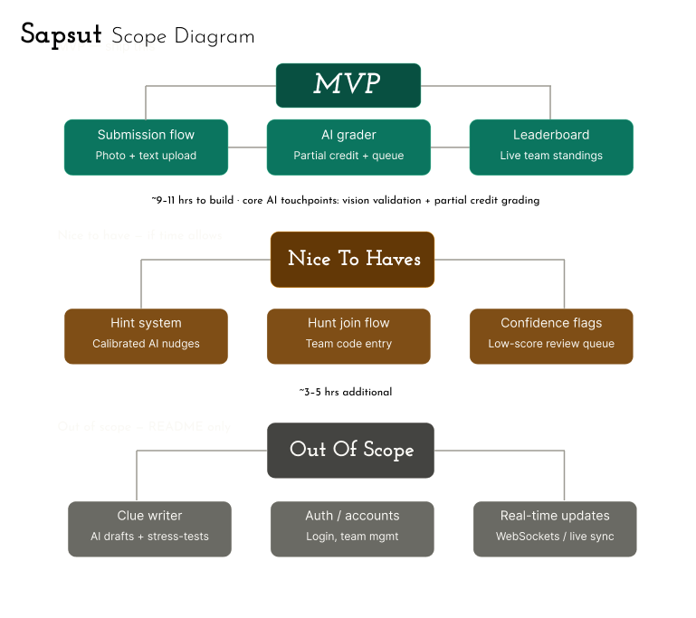

# Sapsut
Husky Hunt App Companion

Problem Statement
Northeastern Husky Hunt is the Resident Student Association’s (RSA) premier annual event — a fast-paced, 24-hour scavenger hunt that takes teams of undergraduate students across Northeastern’s campus and throughout the city of Boston.

During the Hunt, teams race to solve puzzles, uncover hidden locations, collect unique items, and complete a variety of creative and physical challenges. 

Today, the event relies on manual grading: organizers individually review every photo submission and text answer, score them by hand, and update standings themselves. These leads to weeks of delay between the event and the reveal of scores and the awarding of prizes as there are 50 teams with up to 12 people in each team. 

This is a significant bottleneck as the delayed feedback for participants extinguishes the weight of the award ceremony.This hits hardest at the worst possible time of the semester. Organizers are student volunteers juggling finals, projects, co-ops, and job searches at the end of the semester. Manual review at this scale leads to scoring inconsistencies due to the natural variance of human judgement.

The Solution
Sapsut solves this by bringing AI into the equation. Teams submit photos and text answers through a mobile app; GPT-4o handles visual perception — confirming what's actually in an image and returning a structured description. Claude then takes that description alongside the task requirements and reasons through scoring: assigning a score, confidence level, and written rationale. Simple input-output solutions are approved automatically. Submissions that require more nuanced interpretations are passed along to the organizers, equipped with Claude's rationale to make fast reviews. 

Sapsut transforms Husky Hunt from a 24-hour sprint with a weeks-long wait into an experience with a real finish line. Same-day results mean the awards ceremony happens while the energy is still alive. Teams are incentived to cross the finish line knowing it meant something. The grueling 24 hours becomes worth it when the payoff is immediate, and the drawn-out process that killed motivation is gone.

AI Integration
What LLMs, models, APIs, or agentic patterns did you use, and why did you choose them? Did you use RAG, tool
use, multi-step reasoning, or chaining? What tradeoffs did you consider around cost, latency, reliability, or
accuracy? Where did the AI integration exceed your expectations, and where did it fall short?

Architecture / Design Decisions

Explain your design choices: backend/frontend structure, data flow, use of APIs, MCP server integration, or other
AI features. Note any tradeoffs or assumptions you made.

What did AI help you do faster, and where did it get in your way?
Describe how you used AI coding tools (e.g., Cursor, Copilot, Claude) to accelerate your development process.
What did they help you move through quickly? Where did you hit limitations or have to work around them? How
did using these tools change your approach to the build?

Getting Started / Setup Instructions
Include clear steps for running your project locally.
git clone <repo-url>
cd <project-folder>
pip install -r requirements.txt
# Set up environment variables
cp .env.example .env
# Edit .env with your keys
python main.py

Demo
Explain how to use your application or run demos. Include screenshots, example commands, or links to videos if
helpful.

Testing / Error Handling (Recommended)
Explain how you tested your project and any error handling you implemented. Evaluators look for evidence that
you thought about failure modes, not just the happy path. Even a brief description of edge cases you considered
is valuable.

Future Improvements / Stretch Goals (Optional)
If you had more time, what features or improvements would you build next? This is a window into how you think
about product evolution and scope.

Link to website URL or application (Optional)
If your creation is accessible to the public, please provide the necessary access details.
