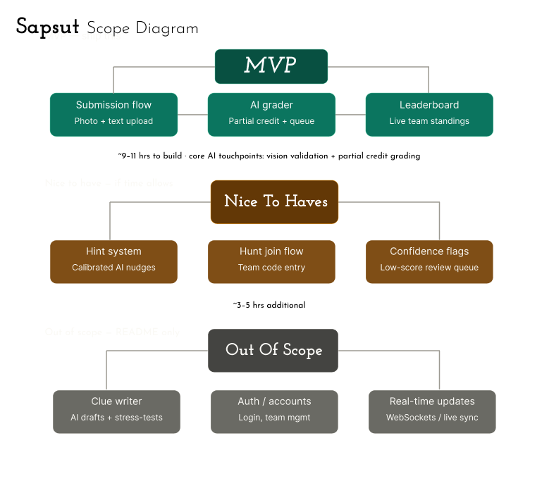

# Sapsut

Husky Hunt app companion for creating tasks, collecting submissions, and scoring them with an AI-assisted review workflow.

**Demo video**: VIDEO_URL_HERE

## AI integration

Sapsut uses a small pipeline so scoring is fast when it can be, and reviewable when it can’t.

- **OpenAI (GPT‑4o)**
  - **Rubric OCR**: organizers can upload a rubric image; the backend extracts plain text and derives initial criteria.
  - **Photo understanding**: when a submission includes a photo, GPT‑4o produces a detailed, plain-language description of what’s in the image.
- **OpenAI embeddings (`text-embedding-3-small`)**
  - Used to embed submission content and retrieve the most relevant criteria for a task (simple semantic retrieval / lightweight RAG).
- **Anthropic (Claude)**
  - Used for **scoring + rationale**. Given the task, rubric/criteria, retrieved “most relevant” criteria, and the submission content (text or GPT‑4o’s photo description), Claude outputs **strict JSON**:
    - `score` (0..max_points)
    - `confidence` (0..1)
    - `rationale` (human-readable)

### Auto-approve vs review queue

Submissions land in one of three states:

- **Auto-approved**: if confidence is above the configured threshold (or it’s a perfect score with high confidence).
- **Flagged for organizer review**: if the model is uncertain or output validation fails.
- **Reviewed**: when an organizer approves or overrides a queued item.

Confidence thresholds are configurable via environment variables:

- `AUTO_APPROVE_CONFIDENCE_THRESHOLD` (clamped to \([0.9, 1.0]\); default `1.0`)
- `AUTO_APPROVE_MAX_SCORE_CONFIDENCE_THRESHOLD` (clamped to \([0.8, 1.0]\); default `0.95`)

### Why this setup

- **Speed + accuracy**: GPT‑4o is used where it’s strongest (vision/OCR). Claude is used where it’s strongest (structured reasoning + written rationale).
- **Reliability**: Claude is required to return **strict JSON**; invalid output falls back to the review queue rather than silently producing a wrong score.
- **Cost control**: embeddings + retrieval keep the prompt focused by surfacing the most relevant rubric criteria.

## AI-assisted development process (Klaviyo AI Builder context)

This project was built with AI as a **planning + implementation accelerator**, not just as an in-product feature.

- **Feasibility + scope shaping**
  - Used AI early to check feasibility against my current skills/time constraints.
  - Refined the feature list into a concise, shippable flow and bucketed work into **MVP / Nice-to-haves / Out of scope**.
- **Branding + story**
  - AI helped explore direction for **logo, typeface, and colors** after I provided the name and history.
  - **Sapsut** references a husky whose father was part of the renowned dog-sled team that delivered emergency medicine to remote communities in Alaska (a \(\sim 674\) mile journey). The son was brought to Northeastern’s campus in 1927 when the school took on the Husky mascot.
- **System design acceleration**
  - Used AI to generate a draft **database schema**, **tech stack**, and a **data dictionary**, then iterated to match the actual product flow.
  - Used AI to create **seed data** for faster UI + API iteration.
- **Tooling + automation**
  - Connected **Supabase** as an MCP server inside Cursor to speed up iteration.
  - Used AI to help create and refine **GitHub issues**, draft PR descriptions, and review PRs.
  - Set up **CI/CD** with AI assistance (initial pipeline + iteration).
- **UX/dev constraints**
  - Used AI to convert SVG logos into PNGs due to Expo constraints in parts of the asset pipeline.
  - Used an AI “planner” approach to refine prompts/outputs and asynchronously plan future features.

## Architecture / design decisions



- **Mobile app**: Expo / React Native (Expo Router).
- **Backend API**: FastAPI (`backend/main.py`), with routes for tasks, submissions, teams, leaderboard, and organizer actions.
- **Database + storage**: Supabase (tables for tasks/submissions/teams, plus storage buckets for photos).
- **Organizer gating**: organizer routes are protected (organizers provide an organizer code in the app to access admin flows).
- **Dev MCPs**: used Supabase / GitHub / Figma MCPs during development.

### Data flow (scoring)

- Participant submits **text**, **photo**, or **combo**.
- If there’s a photo:
  - backend downloads it from Supabase Storage
  - GPT‑4o generates a description
- backend embeds the submission content and retrieves top matching criteria
- Claude returns `{ score, confidence, rationale }` as strict JSON
- backend either:
  - **auto-approves** and updates team totals, or
  - **flags** and inserts into a **review queue** for organizers to approve/override

## Getting started

### Prereqs

- Node.js + npm
- Python 3.11+ (recommended)
- A Supabase project (URL + service key)
- API keys:
  - OpenAI
  - Anthropic

### 1) Install dependencies

Mobile app:

```bash
npm install
```

Backend:

```bash
python -m venv .venv
source .venv/bin/activate
pip install -r backend/requirements.txt
```

### 2) Environment variables

Create `backend/.env` (the backend loads env via `python-dotenv`).

Required:

- `SUPABASE_URL`
- `SUPABASE_SERVICE_ROLE_KEY`
- `SUPABASE_STORAGE_BUCKET` (bucket name used for images)
- `OPENAI_API_KEY`
- `ANTHROPIC_API_KEY`

Optional:

- `AUTO_APPROVE_CONFIDENCE_THRESHOLD`
- `AUTO_APPROVE_MAX_SCORE_CONFIDENCE_THRESHOLD`
- `ENV` (defaults to `dev`)

### 3) Run the backend API

From the repo root:

```bash
uvicorn backend.main:app --reload --port 8000
```

Health check:

- `GET /health`

### 4) Run the mobile app

```bash
npm run start
```

Then open on iOS/Android via Expo Go or a dev client, depending on your setup.

## Demo

- **Video walkthrough**: https://drive.google.com/file/d/1LMcKjvp_Rk_65xzyr0C0og7QVOUPawNl/view?usp=sharing
## Testing

Backend tests:

```bash
pytest -q
```

## Error handling notes

- **Strict JSON enforcement**: if Claude returns invalid JSON, the submission is flagged for organizer review rather than producing a score.
- **Storage / model failures**: common failure points (download, OCR, embedding, vision description) are captured and recorded as `status=error` with an `ai_result` payload for debugging.

## Future improvements

- Add a small “golden set” evaluation harness for scoring consistency across rubric types.
- Add caching for embeddings and photo descriptions to reduce recompute on rescore.
- Improve organizer analytics (review speed, override rates, confidence calibration).
- Add swipe gestures for faster organizer review.
- Add file upload retry flows (especially for flaky connections).
- Add a notifications system (e.g., submission status updates / organizer alerts).
- Add dark mode.
